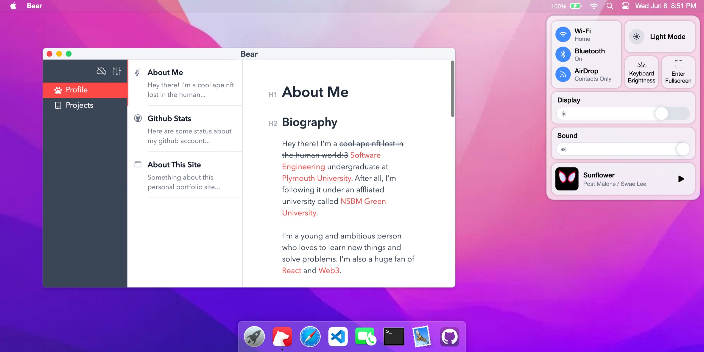
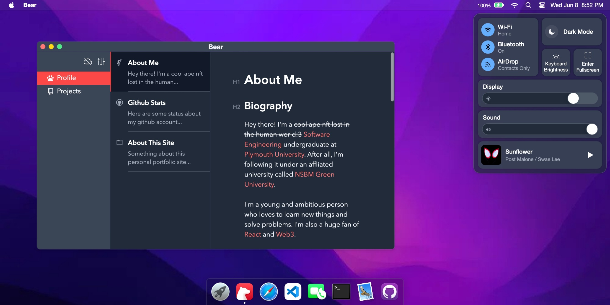

# Sayuru's Resume @ MacOS Playground

My portfolio website simulating macOS's GUI: https://sayuru.dev

Powered by [React](https://reactjs.org/) + [React Redux](https://react-redux.js.org/) + [UnoCSS](https://uno.antfu.me/) + [TypeScript](https://www.typescriptlang.org/) + [Vite](https://vitejs.dev/).


&nbsp



&nbsp;

## Usage

```bash
pnpm install

# serve with hot reload, open http://localhost:3000 to view it in the browser
pnpm dev

# build for production with minification to the `dist` folder
pnpm build
```


&nbsp;

## Credits

- [Renovamen](https://github.com/Renovamen/playground-macos)
- [macOS Big Sur](https://www.apple.com/in/macos/big-sur/)
- [macOS Catalina](https://www.apple.com/bw/macos/catalina/)
- [macOS Icon Gallery](https://www.macosicongallery.com/)
- [sindresorhus/file-icon-cli](https://github.com/sindresorhus/file-icon-cli)
- [vivek9patel.github.io](https://github.com/vivek9patel/vivek9patel.github.io)


&nbsp;

## License

[MIT](MIT)
